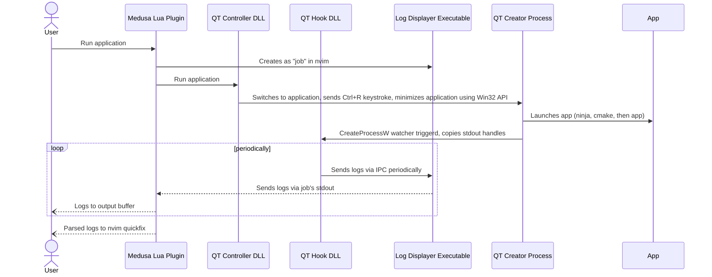

# Medusa

Medusa is a `nvim` plugin that enables me to work on projects that use QT Creator for compiling in `nvim`.

Some of the projects I work on (at work) require me to use QT Creator to compile. The toolchain is highly integrated and I'd rather *not* ditch it entirely. Thus, this plugin allows me to use QT Creator as a sort of "backend" for compiling my code while I develop entirely in `nvim`

## Workflow

